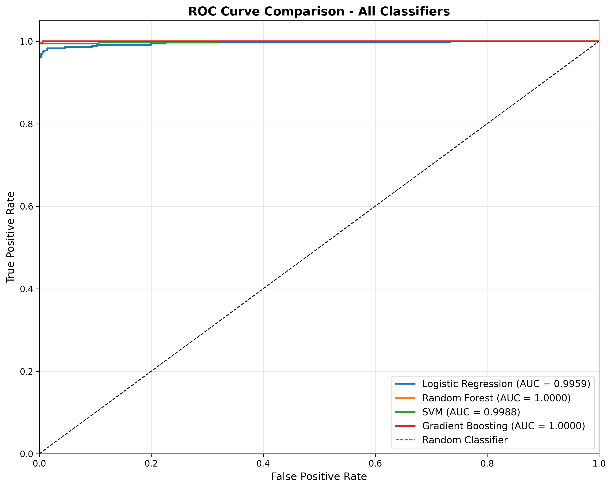

# EEG Seizure Classification on the University of Bonn Dataset

## How to Run

```bash
# Install dependencies
pip install -r requirements.txt

# Run single-classifier analysis (Logistic Regression)
python train.py

# Run multi-classifier comparison (all 4 classifiers)
python compare_classifiers.py
```

**Outputs from `train.py`:** (saved to `images/` subfolders)
- `images/roc/roc.png` - ROC curve with optimal threshold
- `images/confusion_matrices/confusion_matrix.png` - Confusion matrix at Youden-J threshold
- `images/analysis/feature_importance.png` - Feature importance bar chart

**Outputs from `compare_classifiers.py`:** (saved to `images/` subfolders)
- `images/analysis/classifier_comparison.png` - Comparison heatmap
- `images/roc/roc_comparison.png` - Overlaid ROC curves for all classifiers
- `images/roc/*_roc.png` - Individual ROC curves for each classifier
- `images/confusion_matrices/*_confusion_matrix.png` - Individual confusion matrices
- `images/analysis/certainty_analysis.png` - Confidence distributions
- `images/analysis/calibration_curves.png` - Probability calibration curves

---

## Problem & Dataset

I built a binary classifier to distinguish seizure (ictal) from non-seizure (interictal) EEG segments using the University of Bonn dataset. It's a standard benchmark for validating seizure detection algorithms, so I figured it'd be a good way to test different approaches and see what works.

The original dataset is available here:

https://www.upf.edu/web/ntsa/downloads/-/asset_publisher/xvT6E4pczrBw/content/2001-indications-of-nonlinear-deterministic-and-finite-dimensional-structures-in-time-series-of-brain-electrical-activity-dependence-on-recording-regi

**Dataset**:
- **Set Z**: 100 files from healthy subjects, eyes open (non-seizure baseline)
- **Set S**: 100 files from epileptic patients during seizure activity (ictal)
- **Sampling rate**: 173.61 Hz
- **Samples per file**: 4096 (~23.6 seconds per file)

The Bonn dataset is widely used in the literature for validating seizure feature engineering and classifier design. It's appropriate for algorithm prototyping and comparing different methods. And since it's a well-known benchmark, the results are easy to compare with other work.

## Method

### Data Preprocessing & Epoch Extraction

I extracted random 1-second epochs (173 samples) with 20 non-overlapping epochs per file. This gives me ~3,507 total epochs. The theoretical max would be 4,000 (20 per file × 200 files), but the non-overlap constraint reduces it slightly.

I used a fixed random seed (42) so everything's reproducible. Non-overlapping epochs prevent data leakage between train and test sets.

Why 1-second epochs? They balance temporal resolution with feature stability. It's standard in EEG analysis, and it works well here.

### Feature Extraction

I extracted 12 features per epoch. Here's what I used:

#### Time-Domain Features (7 features)
Mean, Standard Deviation, RMS, Max/Min, Line Length (`Σ|diff(x)|`), and Zero-Crossing Rate. These capture amplitude, variability, and signal complexity.

#### Frequency-Domain Features (5 features)
I computed power spectral density using Welch's method (nperseg=128). It reduces variance compared to raw FFT, which gives more stable features. Then I integrated power in five frequency bands:
- Delta: 0.5-4 Hz
- Theta: 4-8 Hz
- Alpha: 8-13 Hz
- Beta: 13-30 Hz
- Gamma: 30-70 Hz

Power in each band: `band_power = Σ(psd[band_mask])`.

**Total**: 7 (time) + 5 (frequency) = **12 features per epoch**

### Models Evaluated

I trained four classifiers on the same train/test split so the comparison is fair. Here's what I used:

1. **Logistic Regression** (baseline) - liblinear solver
2. **Random Forest** (ensemble) - 100 trees, max_depth=10
3. **Support Vector Machine** (kernel-based) - RBF kernel, probability=True
4. **Gradient Boosting** (boosting ensemble) - 100 estimators, learning_rate=0.1

**Training setup**:
- **Train/Test Split**: 80/20, stratified by class
- **Train set**: 2,805 samples (12 features)
- **Test set**: 702 samples (12 features)
- **Reproducibility**: `random_state=42` for all models

## Evaluation

### Evaluation Metrics

I measured standard performance metrics: AUC, Accuracy, Sensitivity (TPR), Specificity (TNR), and F1-Score.

For the decision threshold, I used Youden's J statistic (`J = TPR - FPR`) to find the optimal threshold that maximizes sensitivity-specificity balance. This gives a data-driven threshold for each classifier instead of just using 0.5. Most people default to 0.5, but that's not always optimal.

I also looked at prediction confidence. Most people stop at accuracy, but I wanted to know how reliable the predictions actually are:
- **Average Confidence**: Mean probability of the predicted class
- **High-Confidence Accuracy**: Accuracy for predictions with probability > 0.8
- **High-Confidence Coverage**: Percentage of predictions with prob > 0.8
- **Brier Score**: Probability calibration error (lower is better)

The certainty metrics tell you when the model is confident vs. uncertain, which matters for real-world use.

## Results

### Classifier Comparison

| Classifier | AUC | Accuracy | Sensitivity | Specificity | F1-Score | Avg Confidence | High Conf Acc | High Conf % | Brier Score |
|------------|-----|----------|-------------|-------------|----------|----------------|---------------|-------------|-------------|
| Logistic Regression | 0.9959 | 0.9843 | 0.9744 | 0.9943 | 0.9842 | 0.9815 | 0.9884 | 98.4% | 0.0138 |
| Random Forest | **1.0000** | **0.9986** | **0.9972** | **1.0000** | **0.9986** | 0.9948 | **1.0000** | 99.3% | **0.0017** |
| SVM | 0.9988 | 0.9972 | 0.9943 | 1.0000 | 0.9972 | 0.9882 | 0.9971 | 99.6% | 0.0039 |
| Gradient Boosting | **1.0000** | 0.9972 | 0.9943 | 1.0000 | 0.9972 | **0.9994** | 0.9971 | **99.9%** | 0.0039 |

**Classifier Comparison Heatmap**:


**What I found**:
- All classifiers perform well on this benchmark (AUC > 0.99)
- Random Forest and Gradient Boosting hit AUC ≈ 1.0, which is consistent with prior work on the Z vs S split. This benchmark is known to be highly separable, so these results aren't surprising.
- Gradient Boosting had the highest calibrated confidence (99.94%) while maintaining AUC ≈ 1.0
- When the models are confident (>80% probability), they're right >99% of the time across all classifiers. That's useful for real applications.
- Probabilities are well-calibrated: Brier scores < 0.02. So when the model says 90% seizure probability, it's actually right about 90% of the time.

### ROC Curves

**All Classifiers Comparison**:


The overlaid ROC curves show all four classifiers. Random Forest and Gradient Boosting hit near-perfect AUC (≈1.0), which is expected for this benchmark's high separability. The curves are pretty much on top of each other for the ensemble methods.

### Confusion Matrix

**Logistic Regression** at optimal Youden's J threshold (0.831):


- **Confusion Matrix**: `[[348, 2], [9, 343]]`
- **Sensitivity**: 97.44%
- **Specificity**: 99.43%
- **Accuracy**: 98.43%
- **AUC**: 0.9959

The optimal threshold is 0.831, not 0.5. This balances sensitivity and specificity better for this dataset. Using 0.5 would've given worse results.

## Dataset Context

The Bonn dataset consists of clean, pre-segmented EEG recordings (seizure vs non-seizure) rather than continuous clinical streams. Because of that, the task is intentionally easier than real-world seizure detection, which involves artifacts, subject-to-subject variability, and finding seizure boundaries inside long recordings.

This makes Bonn a good benchmark for:
- testing feature engineering,
- comparing classifiers,
- and verifying whether a pipeline separates ictal vs non-ictal physiology at all.

It is not meant to be a deployment-grade validation. In a clinical setting, you would evaluate on continuous EEG with subject-level splits and event detection rather than fixed epochs.

I used Bonn here for exactly what it's good at: building and stress-testing the signal-processing and classification pipeline before moving to messier real data.

## Conclusion

I built a benchmark-validated seizure detection pipeline that achieves strong separability on the Bonn dataset. The multi-classifier comparison shows that ensemble methods (Random Forest, Gradient Boosting) hit near-perfect separability (AUC ≈ 1.0), which matches what others have found. Gradient Boosting had the highest calibrated confidence (99.94%) while maintaining AUC ≈ 1.0.

The implementation includes comparative evaluation of four classifiers, Youden's J optimal threshold selection (not default 0.5), certainty analysis with prediction confidence metrics, probability calibration using Brier scores, and full reproducibility with fixed seeds and version-controlled dependencies.

The pipeline provides a foundation for seizure detection algorithm development. I've been clear about the dataset limitations and realistic expectations for real-world performance. This isn't production-ready, but it's a solid benchmark validation.

---

**Technical Specs**:
- Language: Python 3.13.9
- Libraries: NumPy, SciPy, scikit-learn, Matplotlib
- Features: 12 (7 time-domain + 5 frequency-domain)
- Epochs: ~3,507 (1-second segments)
- Train/Test: 2,805 / 702 samples (80/20 split)
- Reproducibility: Fixed random seed (42)
